---
lab:
  title: 'Lab 0: Set up the lab environment'
  description: environment – Dev One, which was created for you.
  duration: 50 minutes
  level: 100
  islab: true
---

# **Lab 0: Set up the lab environment**

**Objective:** In this lab, you will acquire a Power Apps trial license
and will create a team in Microsoft Teams.

## **Exercise 1: Assign a Power Apps trial license**

1.  Open a web browser on your VM and go to
    +++https://powerapps.microsoft.com/en-us/free/+++.

     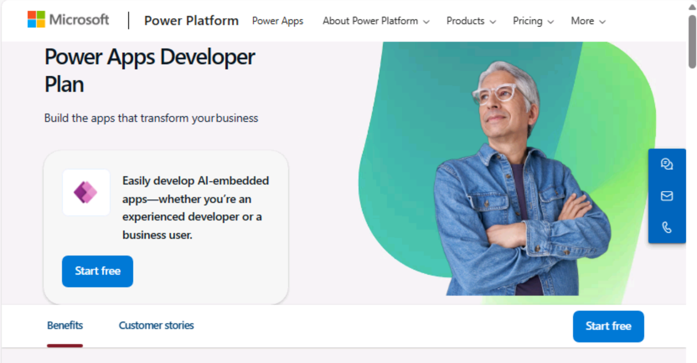

2.  Select **Start free**.

     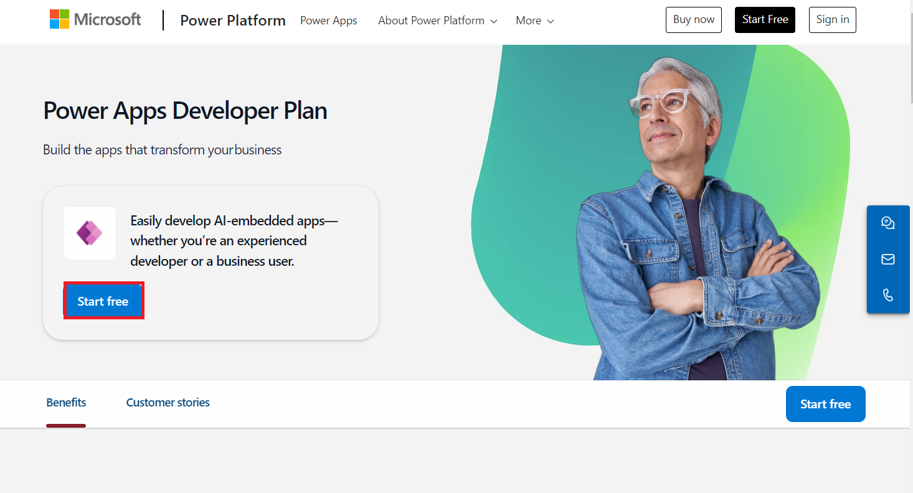

3.  Enter your **Office 365 admin credentials**, check the checkbox to
    **accept the agreement,** and click on **Start free**.

     

4.  Enter the **password of your Office 365 tenant id** and then select
    **Sign in**.

     

5.  Select **Yes** on **Stay signed in?** pop-up window.

     

6.  Keep the **United States** as your **country/region** and then click
    on the **Get started** button.

     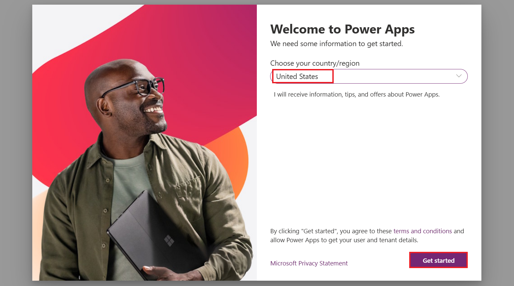

7.  You can now see the **Home page of Power Apps** and the developer
    environment – **Dev One**, which was created for you.

     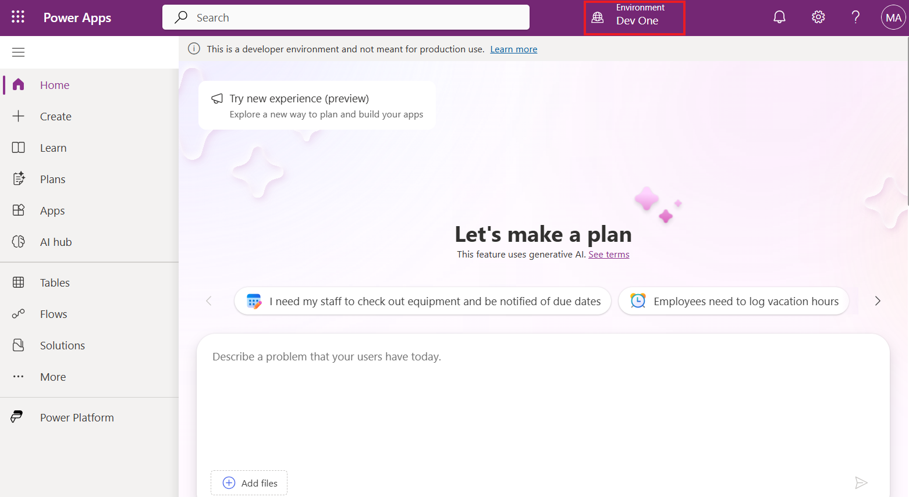

8.  Open the new tab and go to **Power Platform admin center** by
    navigating to +++https://admin.powerplatform.microsoft.com+++, and
    if required, sign in using your given Office 365 admin tenant
    credentials.

     

9.  From the left navigation pane, select **Manage** > **Environments**, and then you can see that **Dev One** is your Dataverse environment.

     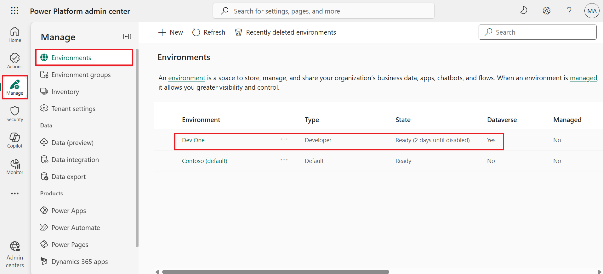

## **Exercise 2: Create a team in Microsoft Teams **

1.  Sign in to Microsoft Teams using +++**https://teams.microsoft.com/**+++ with your Office 365
    tenant credentials.

2.  On **Get to know Teams**, select **Get Started**.

     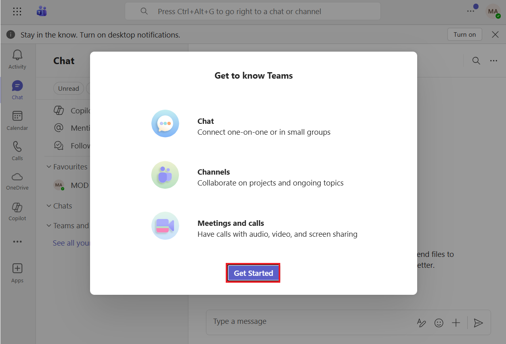

3.  Close the window that asks for scanning the QR code.

     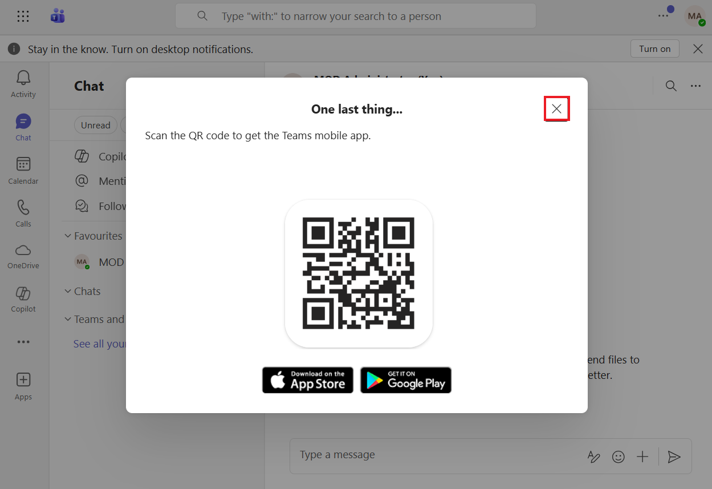

4.  On the left side of the app, select **Chat**.

    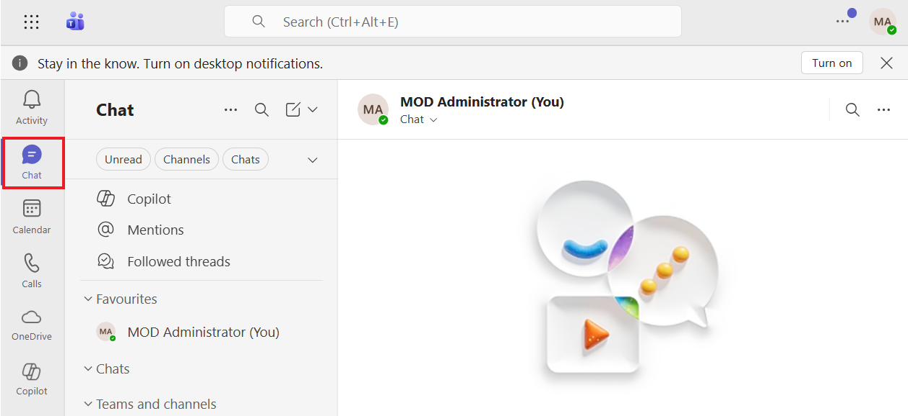

5.  Select **New items** from** **above your list of chats and channels.
    Select **New team**. 

     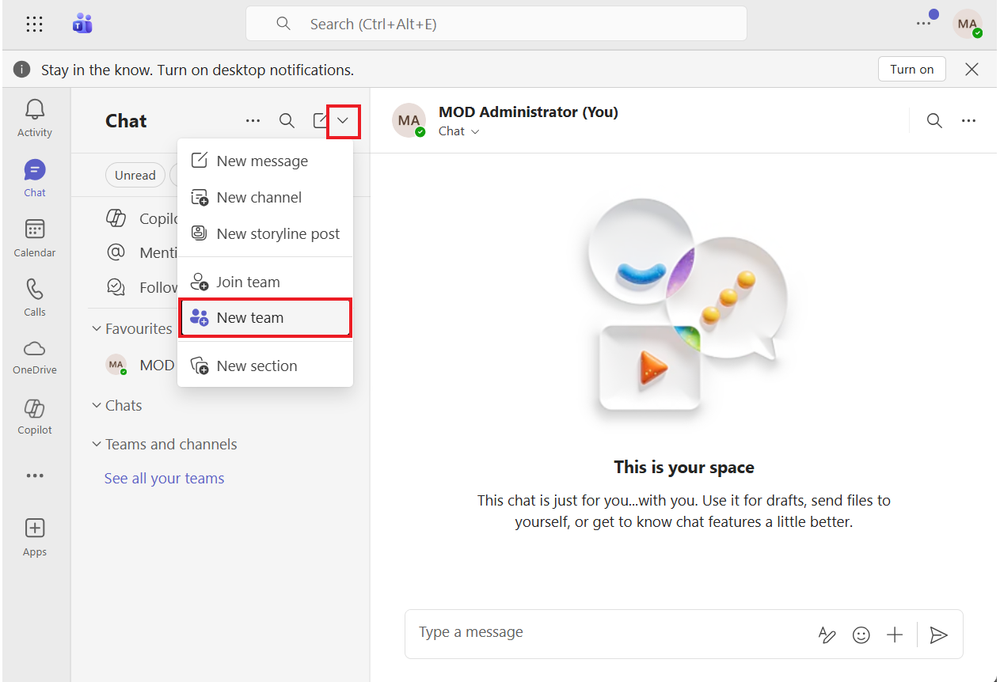

6.  Enter the Team name as **Dev Team**. In the **First channel name**
    field, enter +++**DevChannel**+++ and click on **Private**.

    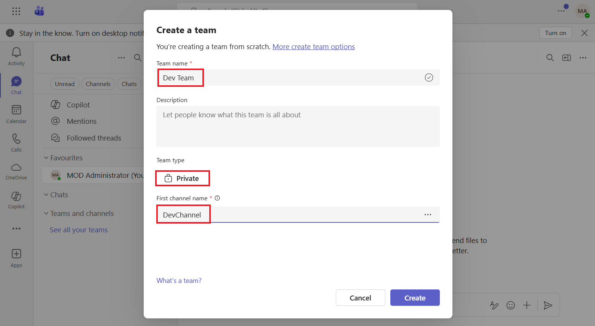

7.  Select **Org-wide**.

    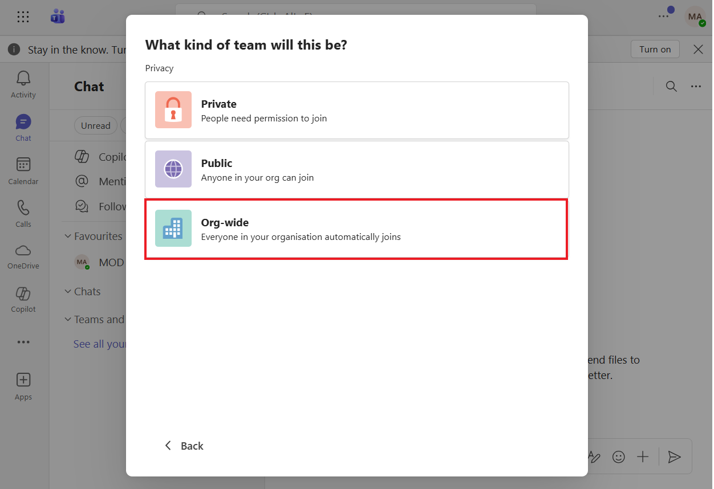

8.  Select **Create**.

    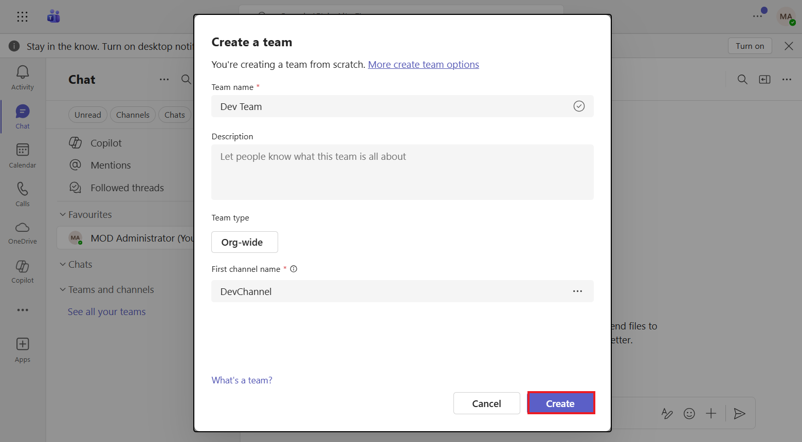

9.  You can now see the **Test** team has been created.

    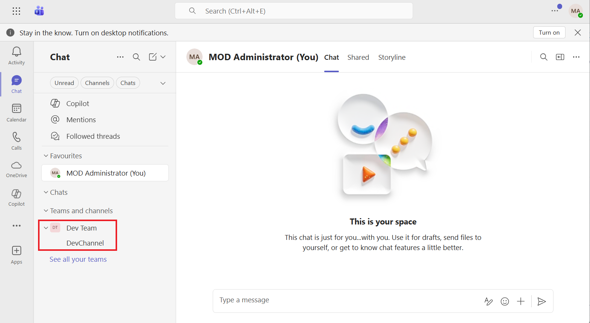

**Summary**: In this lab, you acquired a Power Apps trial license and
created a team in Microsoft Teams.
