---
lab:
  title: Lab 10 - Setting Up Lab Environment for Power Automate Desktop
  description: In this lab, you will learn the process of setting up the
Power Automate Desktop environment. 
  duration: 20 minutes
  level: 100
  islab: true
  primarytopics:
    - Power Automate
---

# **Lab 10 - Setting Up Lab Environment for Power Automate Desktop**

**Objective:** In this lab, you will learn the process of setting up the
Power Automate Desktop environment. By the end of the lab, you will have
successfully installed Power Automate for Desktop, configured browser
extensions, and logged in with your Office 365 credentials.

## **Exercise 1 - Sign in to the Power Automate Desktop application**

1.  Navigate to +++https://make.powerautomate.com/+++ and if
    required, sign in with your Office 365 tenant credentials.

2.  Select **My flows** from the left pane and then select **Desktop
    flows**.

     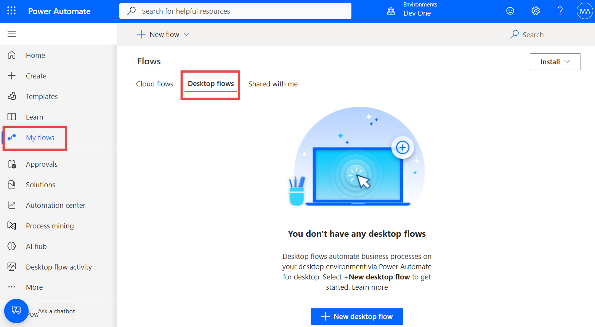

3.  Select **Install > Power Automate for Desktop.**

     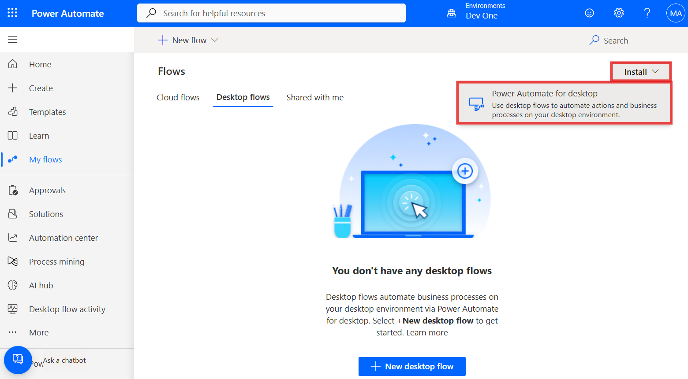

4.  Navigate to the **File Explorer** and select **Downloads** from the
    left pane, then double-click on
    the **Setup.Microsoft.PowerAutomate.exe**.

     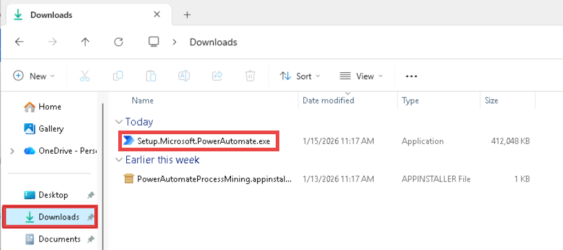

5.  Select **Next** on the **Install Power Automate package** pane.

     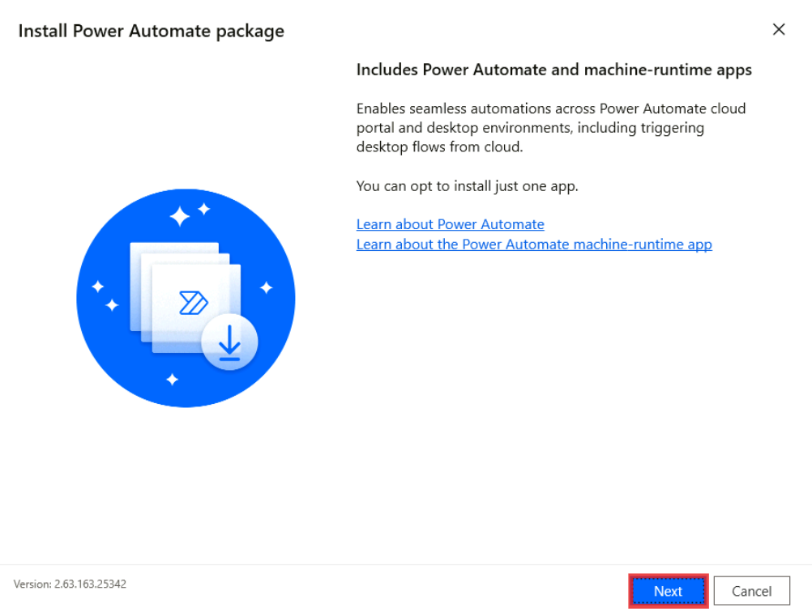

6.  Select all the check boxes. Once you have confirmed that every check
    box is selected, click the **Install** button on the **Installation
    details** pane.

     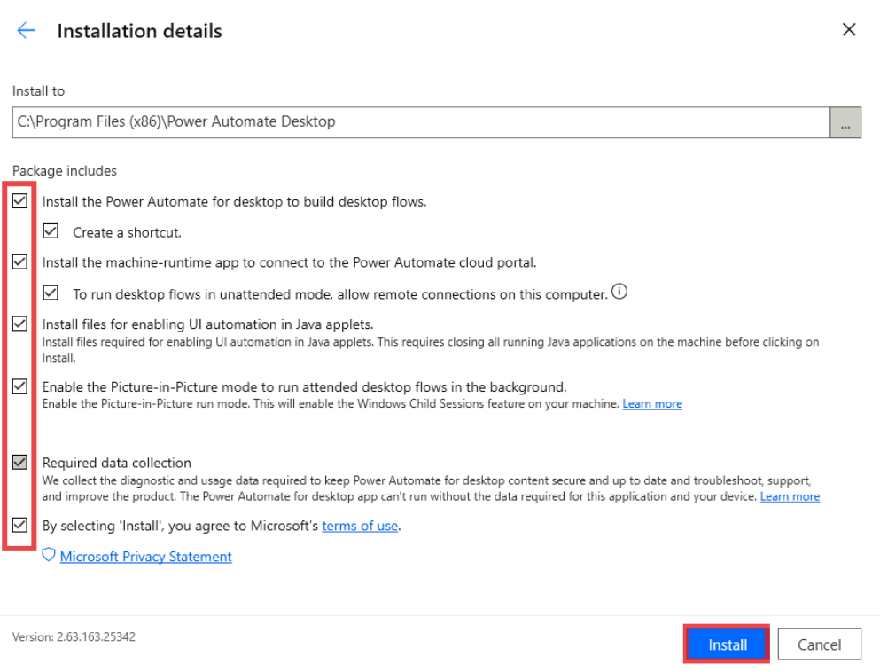

7.  Click **Yes** on **Do you want to allow this app to make changes to
    your device?** dialog.

     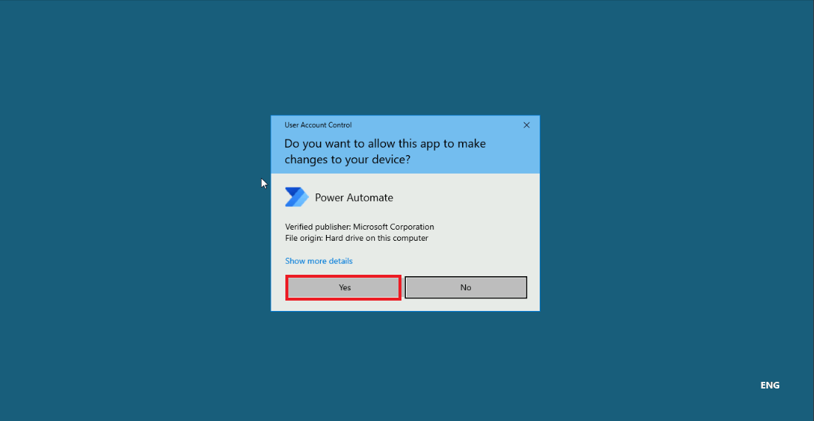

8.  Click on the **Microsoft Edge** to install Microsoft Power Automate
    Desktop.

     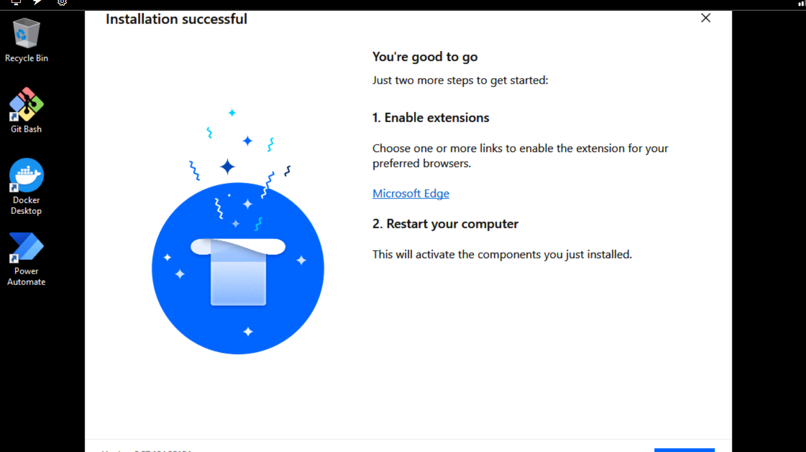

9.  Click on the **Get** button to install the extension, and then click
    on the **Add extension**.

     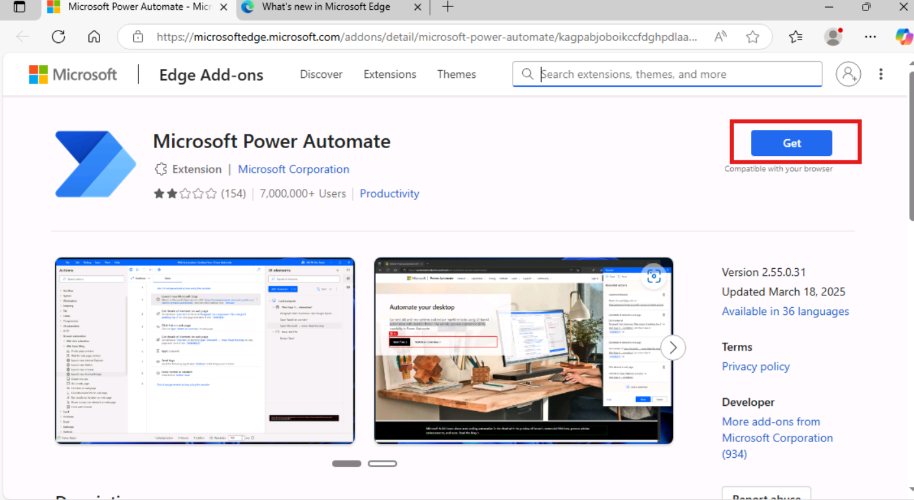
    
     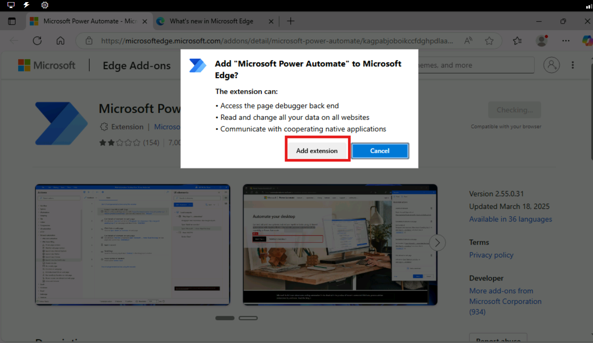

10. Navigate back to the Power Automate desktop installation window,
    then click on the **close** button.

     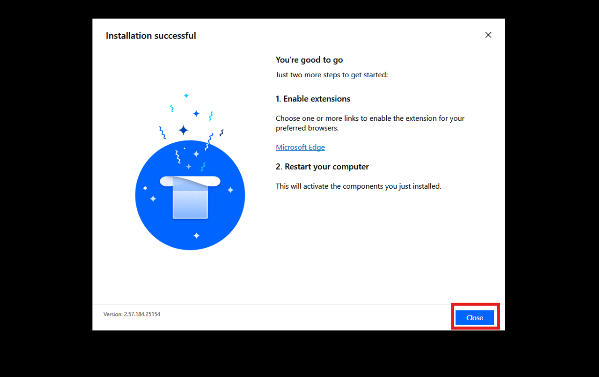

11. Open the Power Automate desktop app and click on the **Sign
    in** button.

     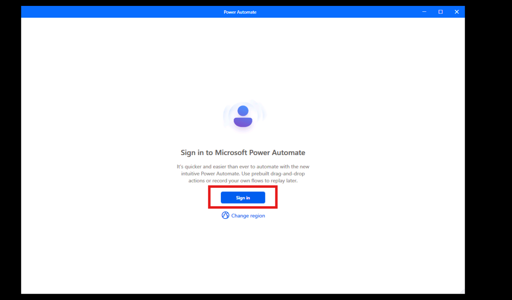

12. Select **Work or school account** type and then click on
    the **Continue** button.

     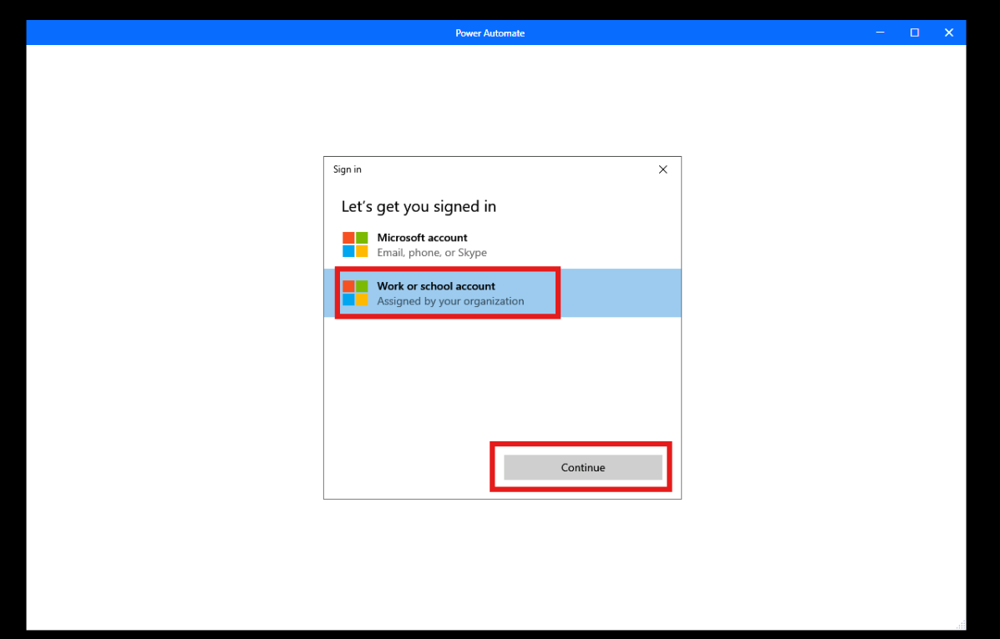

13. Enter the admin tenant credentials in the field and then click on
    the **Sign in** button.

     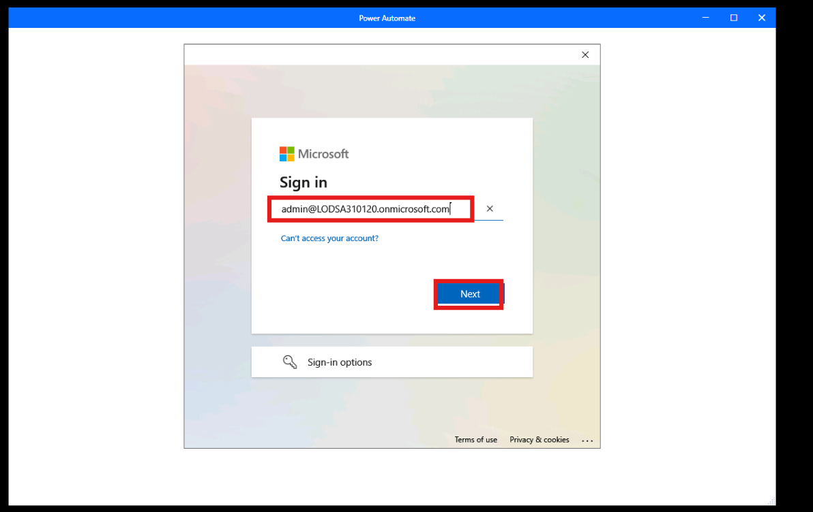

     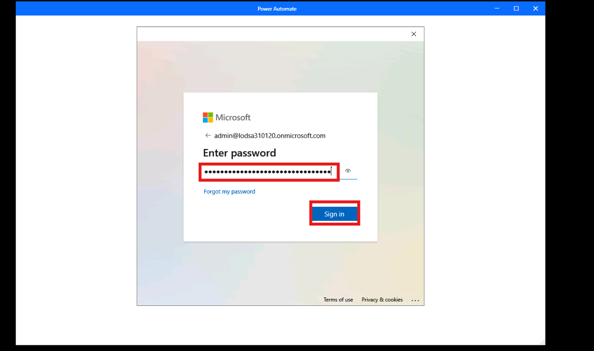

14. Click on the **No, this app only** option.

     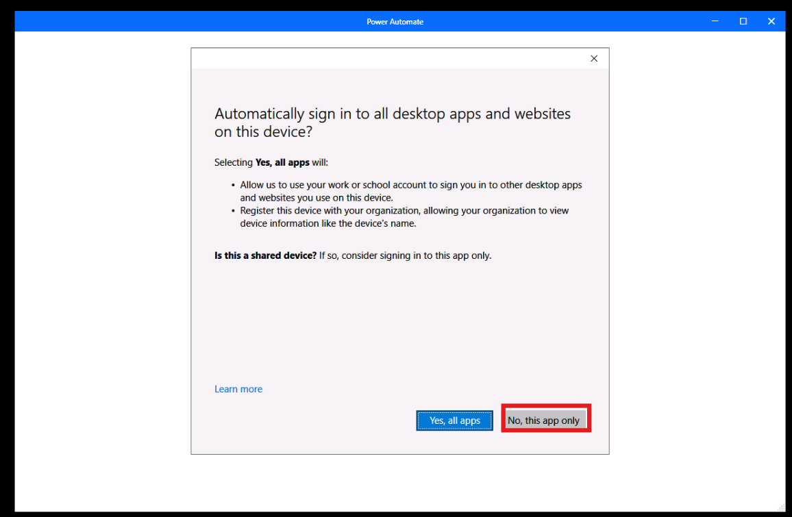

15. Wait for a few minutes while Power Automate prepares Dataverse. Once
    the Dataverse installation is complete, the environment becomes
    active. Click on the **Environments** button and select **Dev One**.

     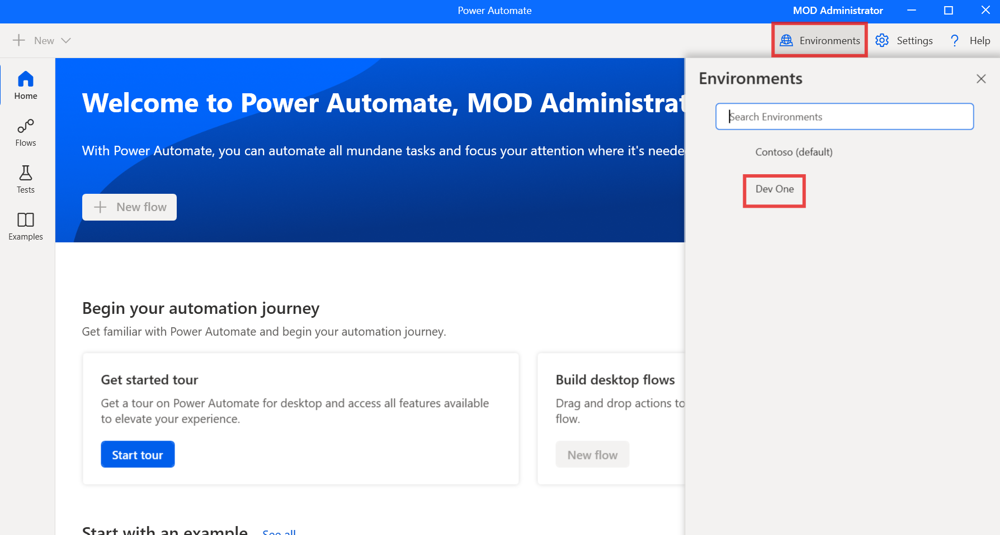

16. You can now see that the **Dev One** environment is selected and the
    **+New** option is enabled.

     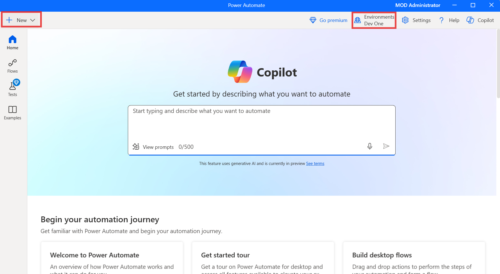

**Summary:** In this lab, you have successfully set up the Power
Automate Desktop environment by installing the application, configuring
browser extensions, and logging in with your Office 365 credentials. By
completing the setup process, you are now ready to use Power Automate
Desktop to automate workflows and tasks. This lab provides the
foundational step to explore automation, ensuring that the environment
is configured correctly for future desktop automation tasks.
