# **Lab 13 - Create a flow to organize and manage files and folders**

**Objective:** The objective of this lab is to automate the process of
backing up files from a designated folder on the desktop using **Power
Automate Desktop**. Participants will create a flow that copies files
from a folder named **Contoso_Files**, moves them to a newly created
backup folder, and appends a timestamp to the backup file. This lab
provides practical experience in automating file management tasks,
including creating folders, copying files, and renaming them with
dynamic date and time formats.

## **Exercise 1: Create a folder and Desktop flow**

1.  Create a folder on your desktop and rename it as +++Contoso_Files+++

     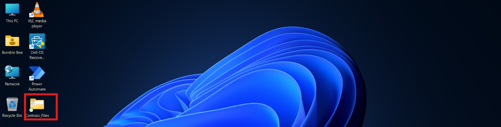

2.  **Select the Report.txt** file from the **C:\Labfiles** folder and
    move the .**txt** file to the **Contoso_Files** folder.

     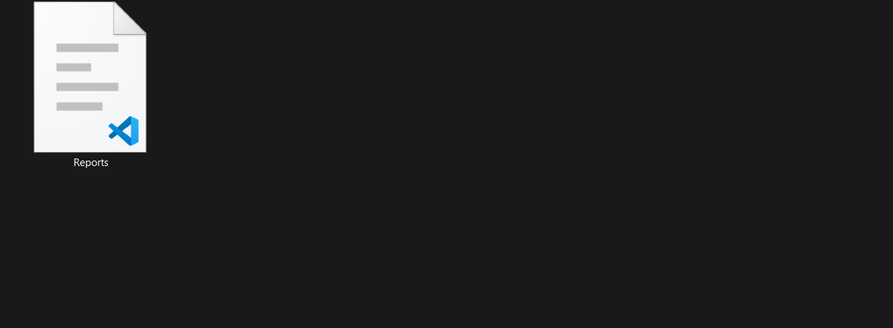

3.  Open the Power Automate Desktop app and **log in** with **Office 365
    tenant credentials**. Choose the **Dev One** environment from the top bar.

     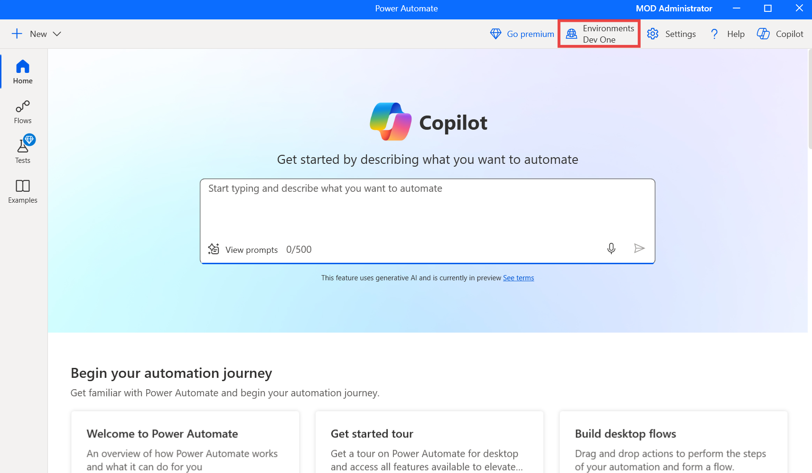

4.  Click on the **+ New** > **Flow** from the top left corner and start creating the new flow.

     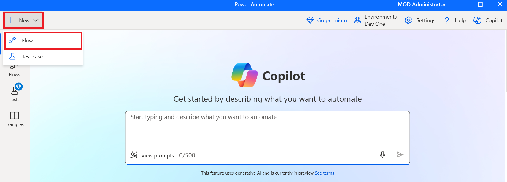

5.  Enter +++**Backup File Flow**+++ as the flow name and then select **Create**.

     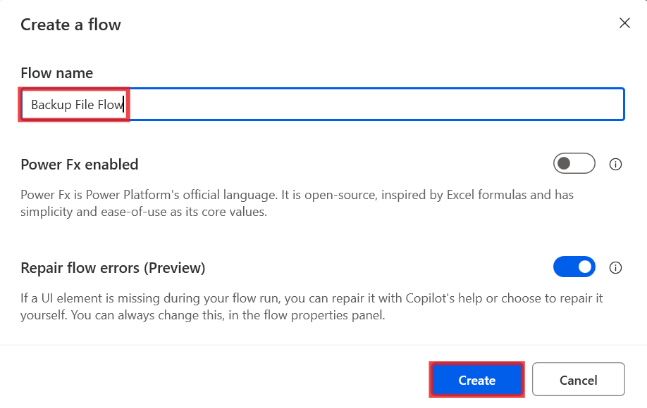

6.  Close the Copilot pane to maximize visibility.

     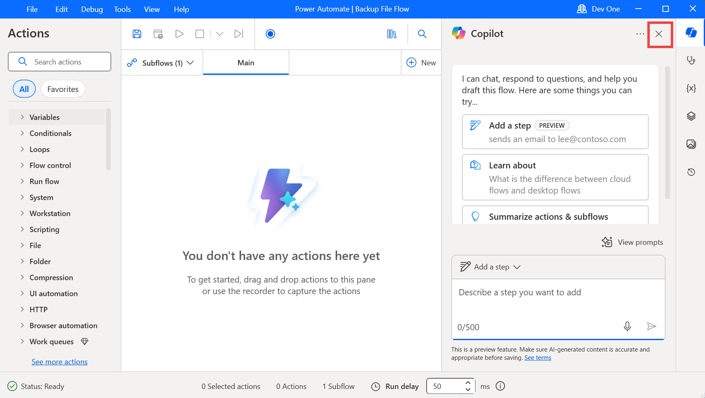

7.  From the **Actions** pane to the left of the screen, search for the
    +++**Get special folder**+++ action and double-click it to add it to the flow.

     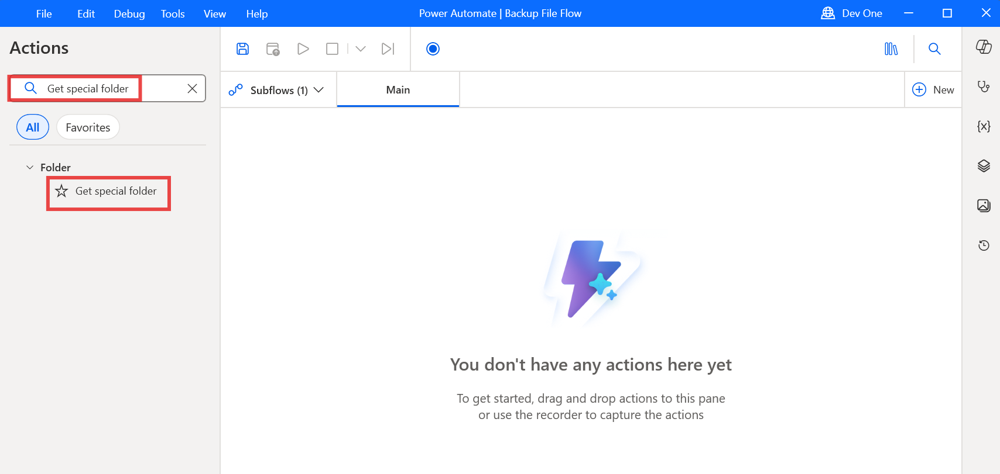

8.  Then click on the **Save** button to save the default setting of the
    button. Ensure that the **Special folder name:** field is set to **Desktop.**

     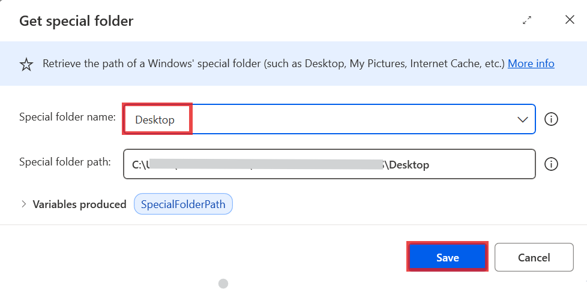

9.  From the **Actions** pane, search for the +++**Get files in folder**+++ action and double-click it.

     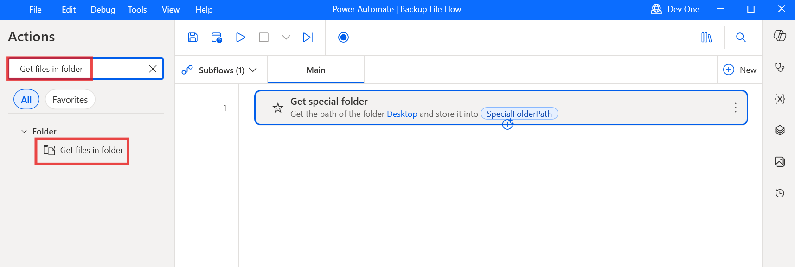

10. In the **Get files in folder** action, set the **Folder** field to
    +++**C:\Users\Admin\Desktop\Contoso_Files**+++. This setting will
    select the folder that you previously created on the desktop. Then click on the **Save** button.

     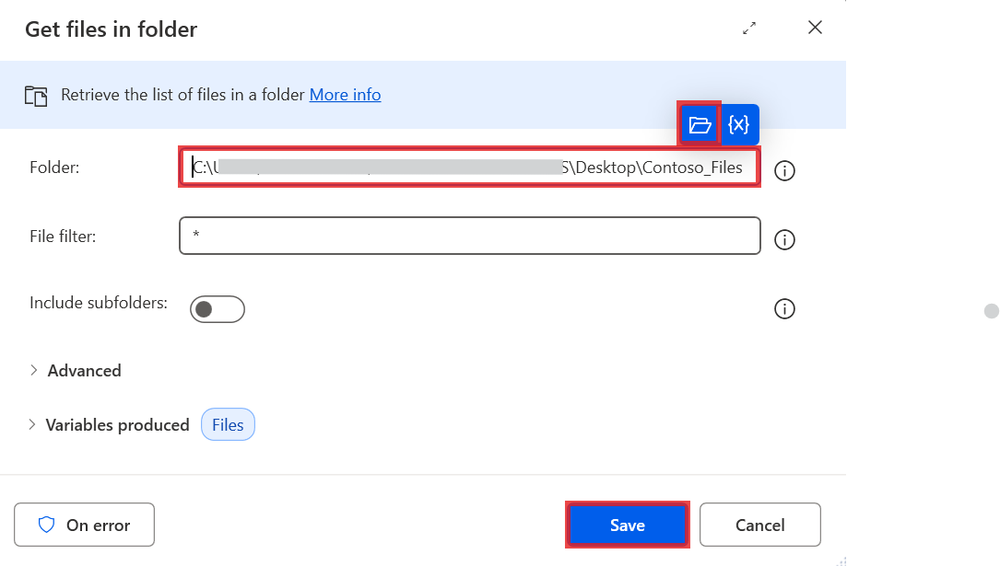

11. From the **Actions** pane, search for the+++**Create Folder**+++ action and double click it.

     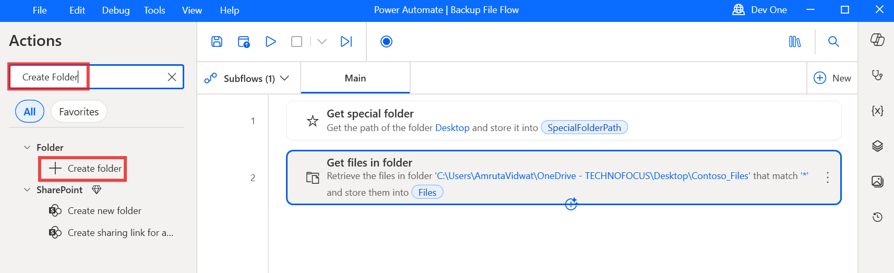

12. In the **Create new folder into** field of the **Create folder**
    action, enter +++**C:\Users\Admin\Desktop**+++. In the **New folder
    name** field, enter +++Contoso_Backup+++. Once done, select **Save**.

     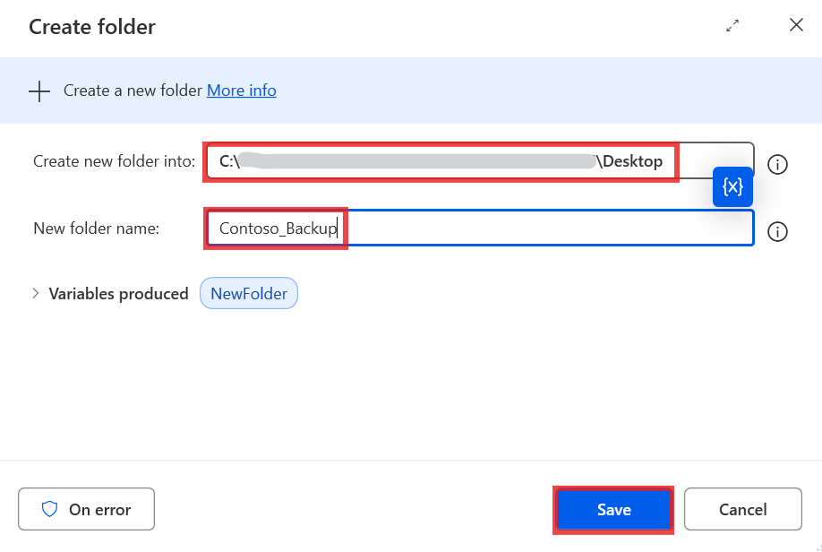

13. From the **Actions** pane, search for the +++**Copy file(s)**+++ action and double click it.

     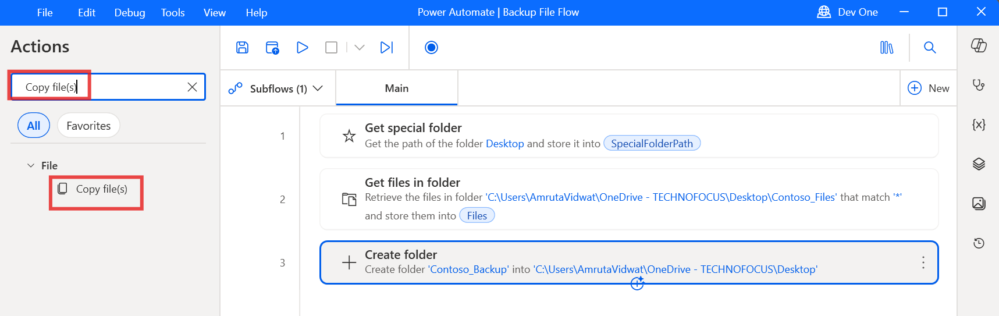

14. Set the **File(s) to Copy** field to +++**%Files%**+++,
    the **Destination Folder** field to +++**%NewFolder%**+++, and
    the +++**If file(s) exists**+++ drop-down option to **Overwrite**.
    After setting up, click on the **Save** button.

     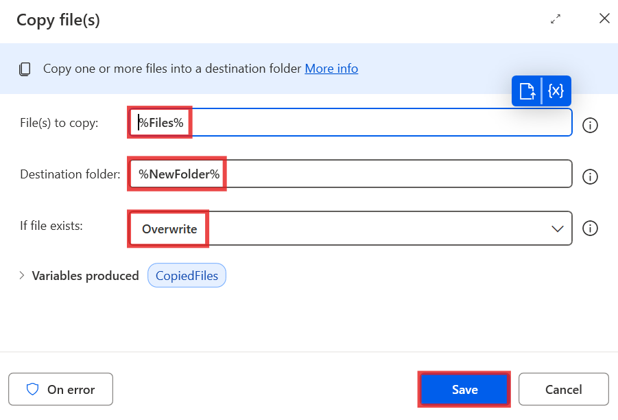

15. To create the log file, add the **Write text to file** action from the **Actions** pane.

     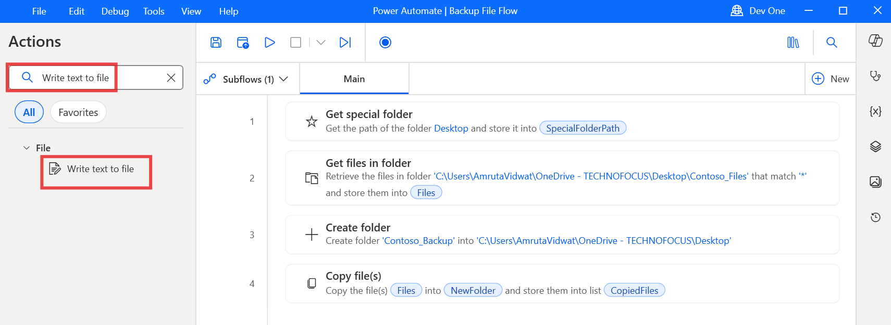

16. Set the **File path** field to **%NewFolder%\Backup Log.txt**. In
    the **Text to write** field, add a message that will show that the
    flow has run successfully, for example – **Backup completed successfully**.

     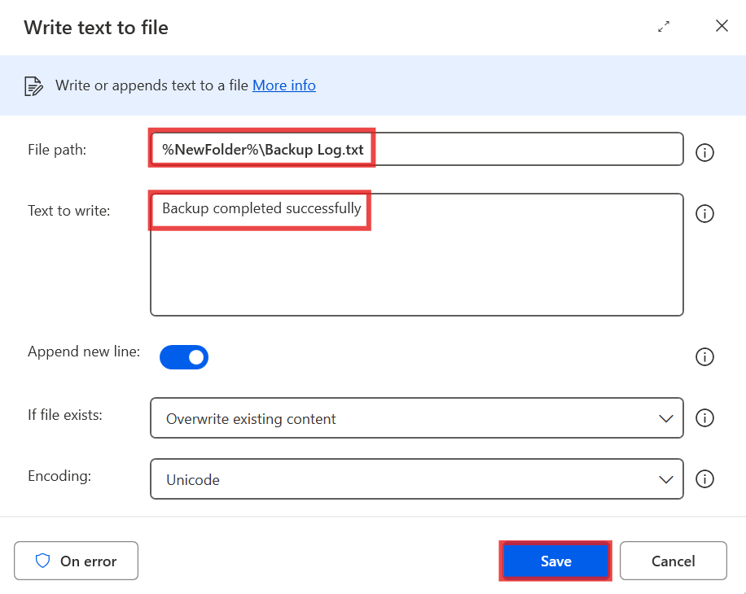

17. From the **Actions** pane, search for the +++**Rename file**+++
    action and double-click it to add it to the flow.

     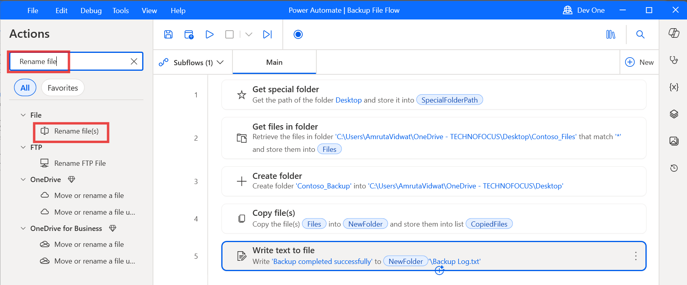

18. Set the **File(s) to rename** field to +++%NewFolder%\Backup Log.txt+++. In the **Rename scheme** drop-down menu, select the **Add datetime** option. Set the **Separator** drop-down option to **Nothing** and the **DateTime Format** option
    to +++**dd.MM.yy_HH.mm**+++. After setup, click on the **Save** button.

     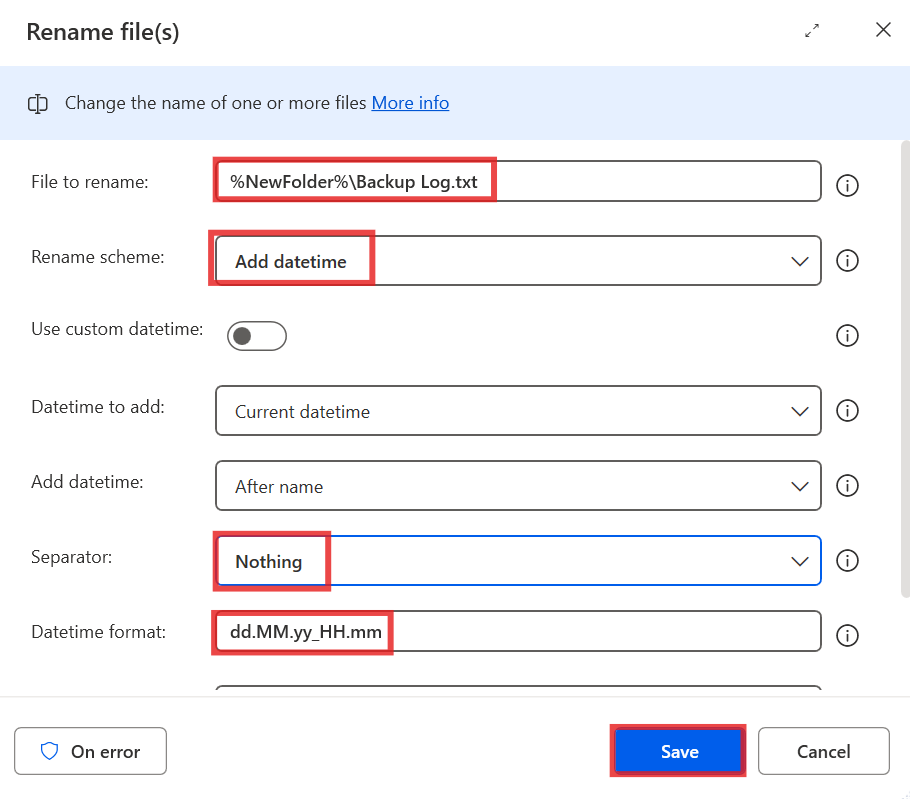

19. The **completed** flow should resemble the following screenshot.

  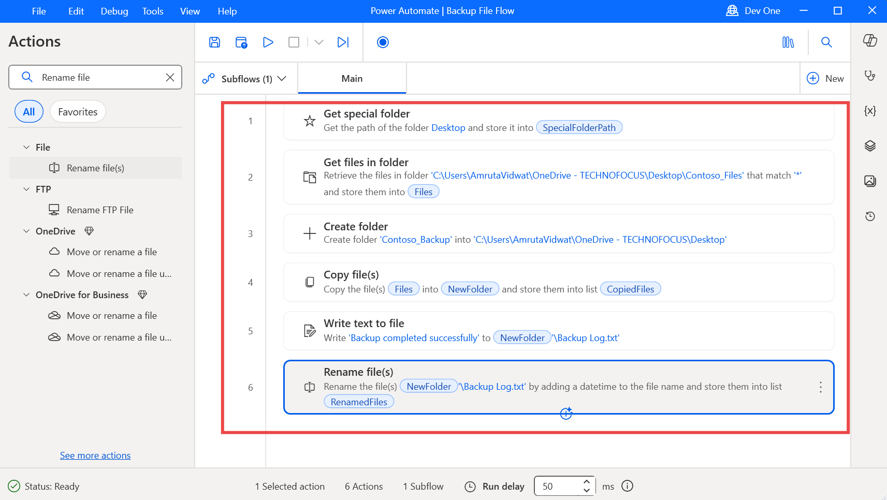

## **Exercise 2: Test the flow**

1.  Select the **Run** button to run the flow.

     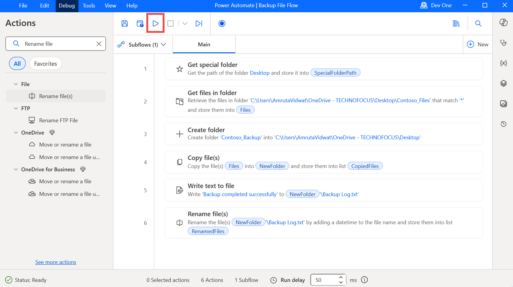

2.  After the run flow has completed, you will have a new folder
    called **Contoso_Backup** on your desktop. The folder will contain
    all contents of the folder named **Contoso_Files** and an additional
    text file called **Backup Log**, which will have the last date and
    time that the flow has run appended to its file name.

     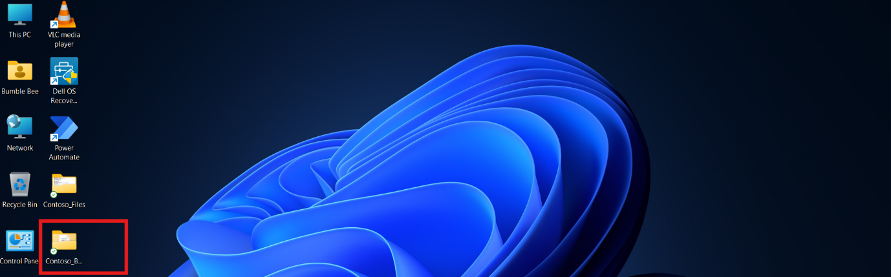
    
     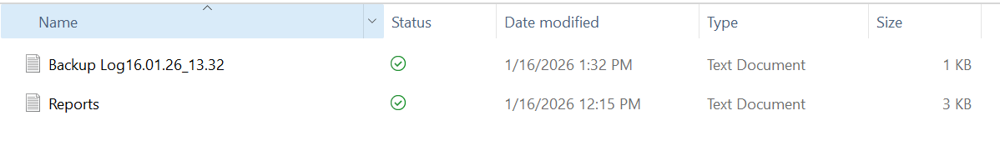

**Conclusion:**

In this lab, participants successfully created a Power Automate Desktop
flow to automate the organization and management of files and folders.
By backing up files from a designated folder named Contoso_Files to a
newly created backup folder, participants gained hands-on experience in
essential file management tasks, including folder creation, file
copying, and dynamic file renaming with timestamps. This lab highlights
the effectiveness of Power Automate Desktop in streamlining file
organization processes, reducing manual effort, and ensuring that
important files are securely backed up. Participants left with practical
knowledge of how to leverage automation for efficient file management,
enhancing their productivity in everyday tasks.
