**Lab 2 - Build an Inventory Management App**

**Objective:** In this lab, you will learn to create a functional
inventory management application using Microsoft Power Apps and Copilot.
Participants will learn to set up their Dataverse environment, design
app screens, manage data, and automate inventory restocking workflows
with Power Automate.

**Exercise 1: Build an Inventory Management App**

**Task 1: Create an inventory management app using Copilot.**

1.  Open a browser and go to +++\*\* sign in with office 365 admin
    tenant account.

2.  Click on the environment in the top right corner and select **your
    developer** environment – **Dev One**.

> 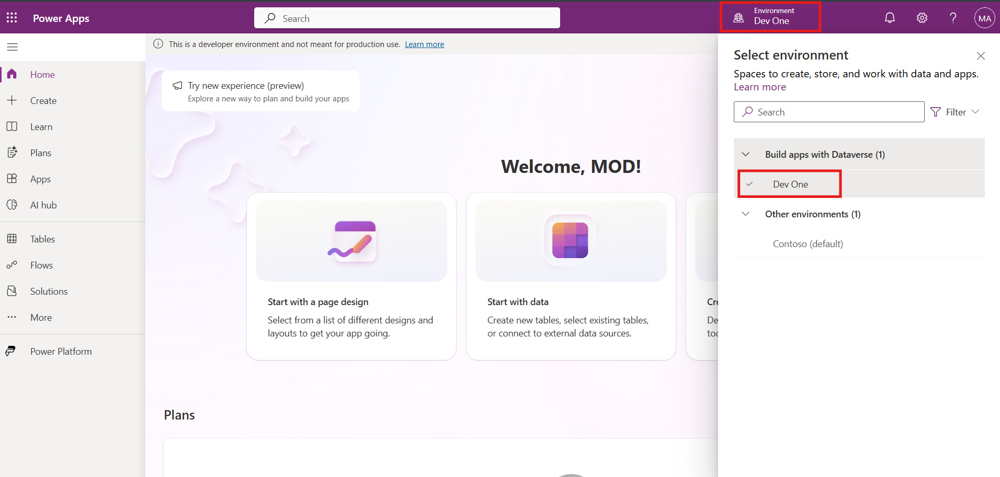

3.  From the left navigation menu, click on **Create** and then select
    **Start with Copilot**.

> 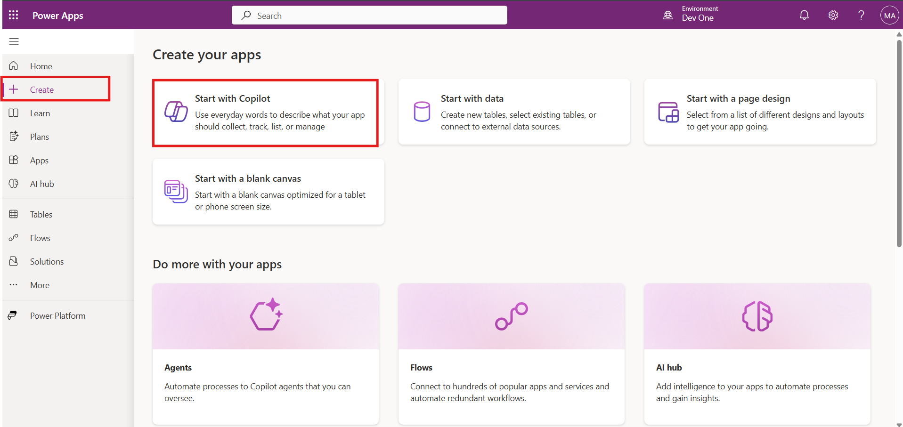

4.  Enter the prompt below and click on the **Generate** button.

> +++**Build a candy inventory management app**+++
>
> 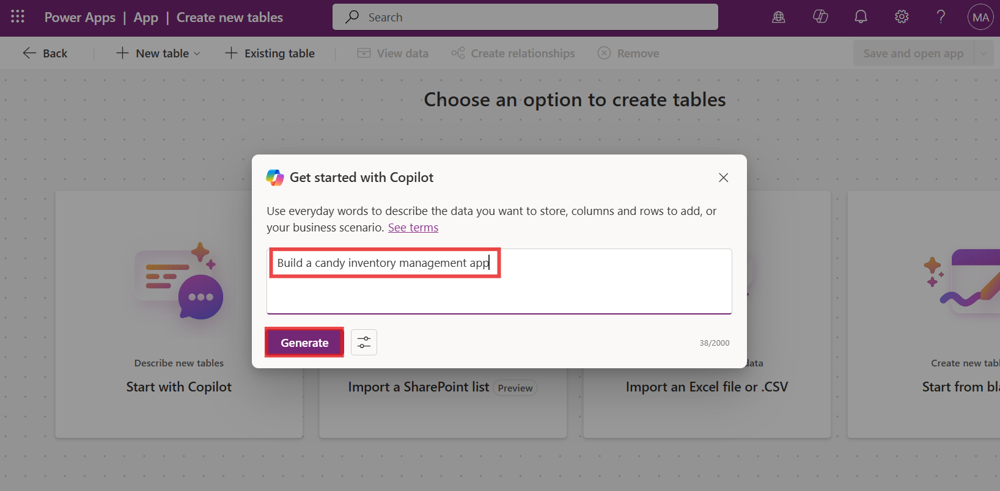

5.  The copilot generates the tables as shown in the image below.

> 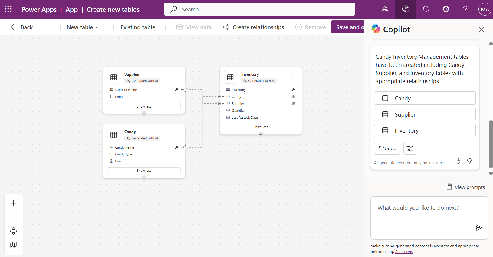

6.  Select the **Supplier** table, then select **View data,** and
    explore the data.

> 
>
> 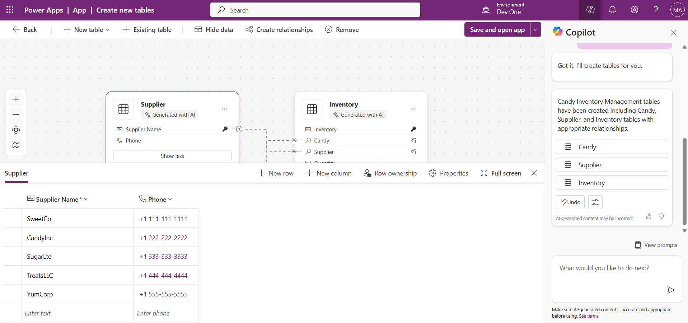

7.  In the Copilot pane, enter the given prompt and then select the
    **send** icon.

> **Prompt**: +++Add a Supplier email column to the Supplier table.+++
>
> 

8.  You can see the column added by Copilot.

> 

9.  Select the **Inventory** table and observe the available columns.

> 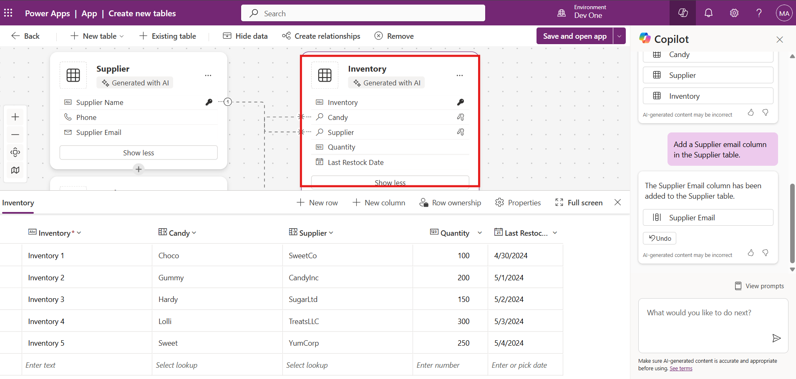

10. Enter the given prompt in the text box and click the **send** icon.
    This column is required to notify when the quantity falls below the
    reorder point.

> +++Add reorder point column to Inventory table+++
>
> 

11. Check if the new column has been added to the table by Copilot.

> 

12. Add a **candyInStock** column with the data type set to **Number**.
    If the quantity is less than the reorder point, the **Quantity**
    column will automatically be updated using **candyInStock**.

> +++Add a candyInStock column to the Inventory table with the whole
> number data type. The records should be in whole numbers.+++
>
> 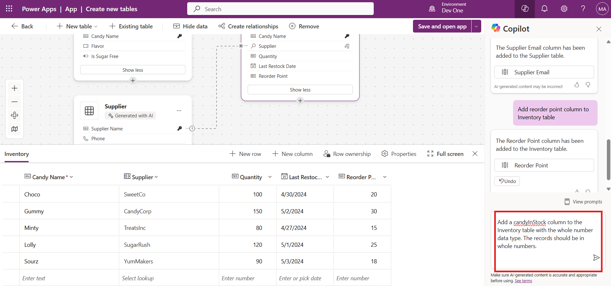
>
> **Note**: After executing the above prompt, if the **Reorder Point**
> column throws a data validation error, then manually change the sample
> values to match the Number data type.

1.  Click on the Record Point column drop-down and select **Edit
    column**.

> 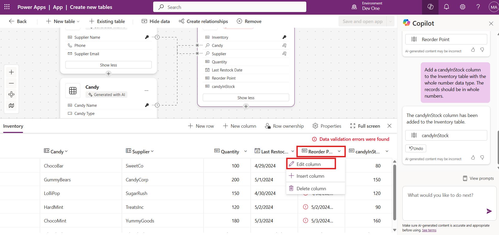

2.  Click on the data type field and select **Number** as the data type.

> 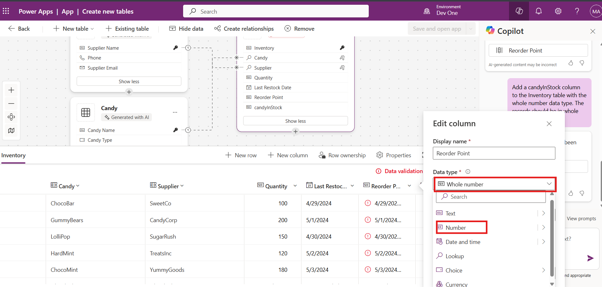

3.  Click on the update button.

> 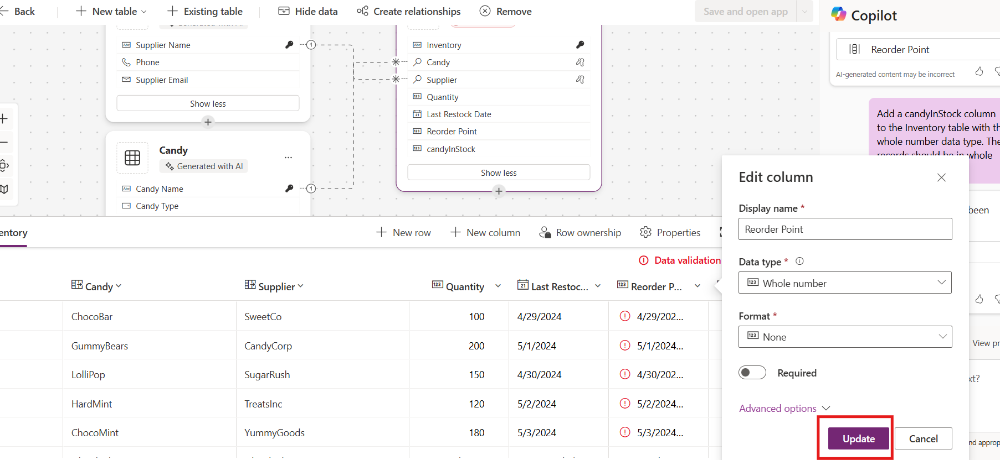

4.  Manually change the record value.

> 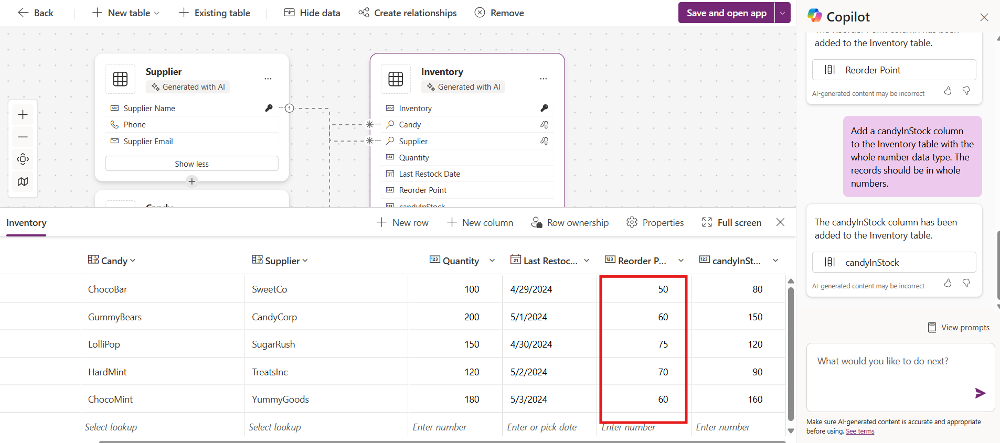

13. The table has been updated with the **Reorder Point** column and
    **candyInStock** column. 

> 

14. Close the **Copilot** pane.

> 

15. Click on the **Save and open app** button.

> 

16. In the **Done working?** window, click **Save and open app**, then
    wait for the app to be created.

> 

17. In the **welcome** window, select **Skip**.

> 

18. The app gets created and should look like the image below.

> 

19. Click the **Save** button, enter the name **Candy Inventory
    Management App**, and then click **Save** again.

> 

**Exercise 2: Create a Power Automate flow to restock the inventory.**

**Task 1: Create a Power Platform flow to trigger restock email**

1.  Log in to **Power Automate** using
    +++<https://make.powerautomate.com/>+++ with your Office 365 Tenant
    credentials. Select the **Dev One** environment from the environment
    selector.

> 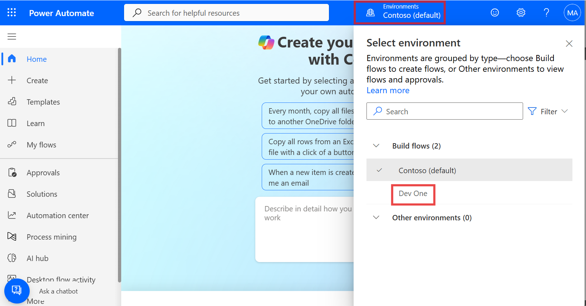

2.  Copy the following prompt and paste it in the Copilot field and then
    select **Generate**.

> **Prompt:** +++Create a candy restock flow when a row is added or
> modified in the Dataverse table. Add a condition to check if the
> quantity is less than the reorder points. If it is less then take an
> approval to update the row+++
>
> 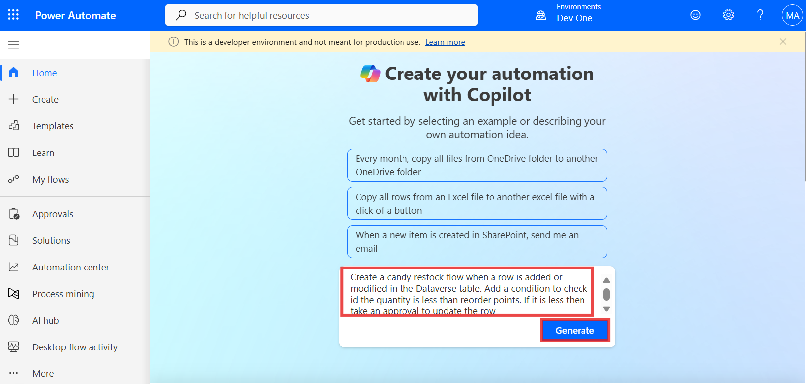

3.  Based on the description, Copilot begins to create a
    suggested trigger and actions for your flow. Select **Keep it and
    continue**.

> 

4.  Review your connected apps and services. A green checkmark indicates
    that the connection is valid. Select **Create flow**.

> 

5.  Select the **When a row is added or modified** step.

> 

6.  Ensure that the **Change Type** is **Added or Modified**. If not,
    then select it from the drop-down menu.

> 

7.  From the **Table Name** dropdown menu, search for and
    select **Inventories**.

> 

8.  Remove the default selection in the **Scope** field and select
    **Organization** from the drop-down menu.

> 

9.  Collapse the **When a row is added, modified or deleted** panel
    using collapse icon on top right corner of the panel.

> 

10. Select the **Condition** step.

> 

11. Observe that Copilot has already added values.

> 

12. But we don’t want these values, i.e., body/quantity. To correct
    that, follow the upcoming steps.

13. Select the **Choose a value** box, remove the default selection, and
    select the dynamic content icon. 

> 

14. Search for the +++ Quantity+++ column and select it. 

> 

15. Similarly, remove the second default value and select the dynamic
    content icon.

> 

16. Search for the +++**Reorder points**+++ column and select it. 

> 

17. Close the **Condition** pane.

> 

18. Expand the **Condition** node.

> 

19. Select the** Start and wait for an approval **action from the flow.

> 

20. From the **Approval Type** dropdown menu, select **Approve/Reject -
    First to respond**.

> After you select the **Approval Type**, more parameters are now
> available.
>
> 

21. Under the **Title** field, enter +++**Approve to Restock**+++ - and
    click on the dynamic content icon.

> 

22. Search for +++**Candy Name**+++ and select it. 

> 

23. In the **Assigned to** field, enter +++MOD+++ and select MOD
    Administrator credentials from the suggestion.

> 

24. In the **Details** field, enter the given text: Select
    Candy(Type)\>from the dynamic content.

> +++Hi Sir,+++
>
> \<Candy(Type)\> +++is out of stock - for customers to place an order.
> Please approve to restock.+++
>
> +++Thanks+++
>
> 

25. Close the **Start and wait for an approval **pane.

> 

26. Select the **Condition** step.

> 

27. Select the **Choose a value** box, select the dynamic content icon. 

> 

28. Select the **Outcome** listed under the **Start and wait for an
    Approval** action.

> 

29. Select the condition as **is equal to** and enter the value
    as **Approve**. Close the **Condition** pane.

> 

30. Expand another **Condition** step and select the **Update a row**
    step.

> 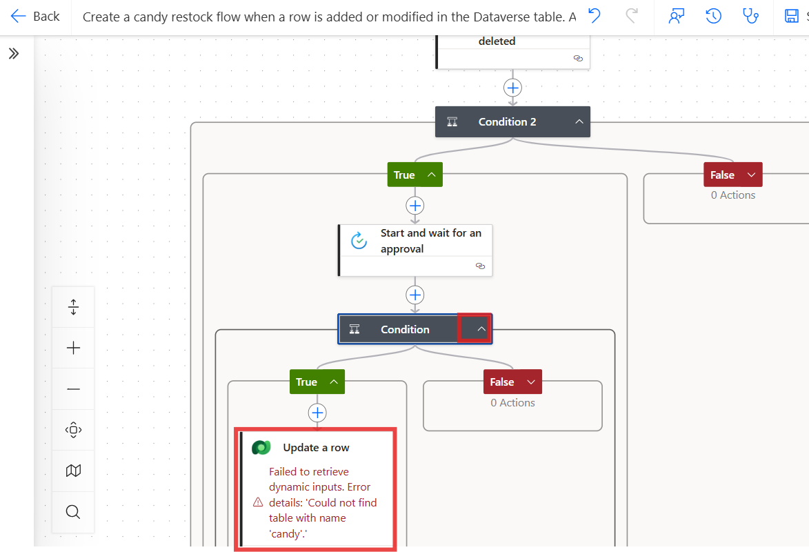

31. Remove the default selection for the **Table name** field.

> 

32. Select **Inventories** table from the drop-down menu.

> 

33. Remove the default selection, select the **Row Id** field and then
    select the dynamic content icon. 

> 

34. Search for a unique identifier column from the Inventories table and
    select it. In this case, it is **Inventory**.

> 

35. Click the **Advanced Parameters** drop-down and select
    the **Quantity** column. 

> 

36. Click inside the **Quantity** field and select the **Function**
    icon.

> 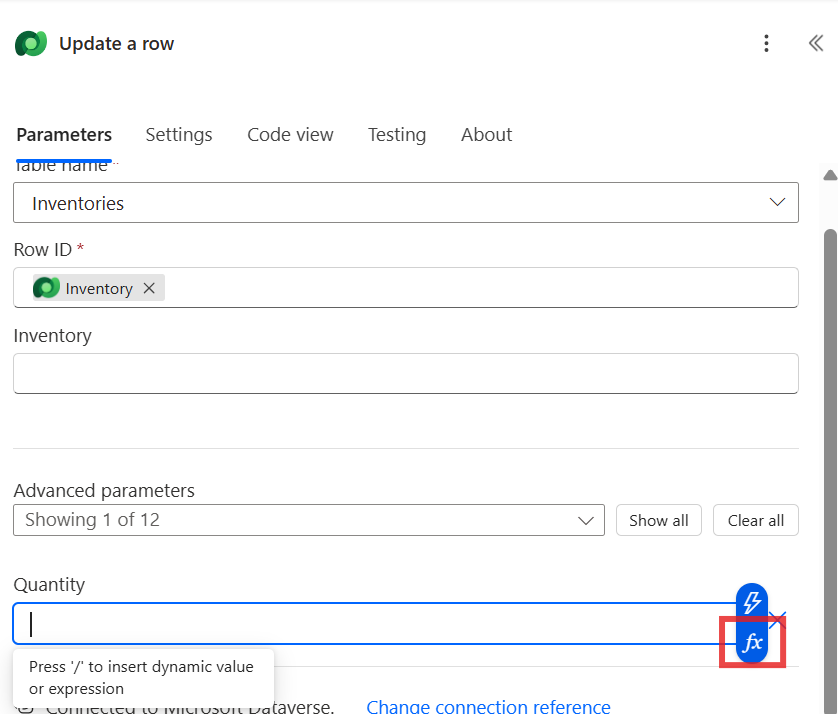

37. Enter the below function (you type in your app) and collapse the
    action.

> **Note:** The below function does not work for you as your column
> schema name will be different. Go to the table --\> column, and copy
> the schema name.
>
> +++add(triggerBody()?\['cr6cd_Quantity'\],triggerBody()?\['cr6cd_candyInStock'\])+++
>
> 

38. Close the **Update a row** pane.

> 

39. Rename the flow - **Candy Restock Flow**.

> 

40. Save the flow by selecting the **Save** button in the upper-right
    corner of the screen.

> 

**Task 2: Test the restock flow**

1.  Switch back to the **Power Apps** tab or open it
    using +++https://make.powerapps.com/+++. From the left pane, select
    Apps and then open the **Candy Inventory Management App**.

> 

2.  Select the **Inventories** screen.

> 

3.  Select **+New.**

> 

4.  Enter the **Quantity** value **less than the reorder
    points** and **commit** changes. Enter **Inventory 3** as an
    **Inventory**.

> 

5.  Switch back to the **Power Automate** tab. Select the **App
    launcher** from the top-left corner.

> 

6.  You should have received an email to restock. Review the email, then
    click **Approve** and **Submit**.

> 

7.  Switch back to the **Power Automate** tab. From the left pane,
    select **My flows** \> **Candy Restock Flow**.

> 

8.  The flow is successful now. 

> 

**Summary**: In this lab, you have learnt to build an inventory
management app with the help of Copilot and implement a Power Automate
flow to trigger restock requests based on inventory levels.
